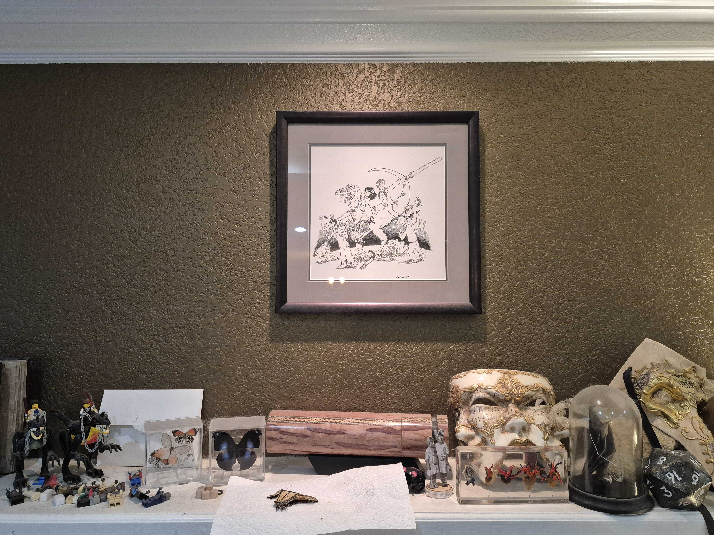

You may have noticed a couple of unusual choices on this site.  So right off the bat, please let me explain . . .

## My Profile Picture

As a wedding present to me, my husband (cool guy, I like him a lot) commissioned a drawing from an artist friend of ours.  I used the close-up of my face as a placeholder some years ago and never got around to getting a replacement.  The full drawing looks like this:

Said artist friend winces whenever he looks at it and says he can do better.  But I'm inordinately fond of it and don't care if he "learned a lot in art school" or if his "style has matured" since then.

## My GitHub Username

My way of being a rebellious teenager was to listen exclusively to classical opera music.  (Yes, I was an exceedingly odd child.)  I still very much enjoy it, but no longer consider myself much of a nerd about the topic.  Nevertheless, the username has stuck around, and I'm too attached to let it go.