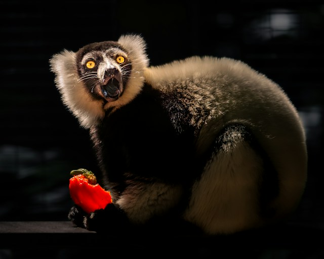
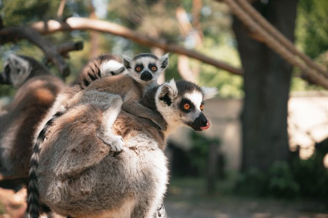

I remember a science activity when I was a child wherein I was tasked with finding a small insect or some such creature.  Then I had a little decision tree with questions like "how many legs does it have?" to help me classify my critter.  I remember it being really convenient in comparison to flipping through a giant book of insects, and I've often looked for a similar approach for quick classification, but without much luck.  Which is probably an indication that my fourth-grade science workbook was overly simplified.



Photo by [Dmytro Koplyk](https://unsplash.com/@dkoplyk) on [Unsplash](https://unsplash.com/photos/a-black-and-white-lemur-holding-a-red-fruit-ywqyvUflZOA)

## But . . . maybe?

But what if we tried it?  Maybe not with insects, there's just too many for a simple proof of concept.  And it would also be nice to sidestep geography as a factor.  Usually if you're trying to figure out what an organism is, you'll first want to know where it came from, but that's not in the spirit of my childhood memory.  And while we're at it, let's choose something charismatic.

I'm thinking lemurs.  They're a pretty unusual group of animals, with just over 100 species.  They're limited in range to the island of Madagascar, checking another box for our POC.

Plus, just look at 'em!



Photo by [Molnár Tamás Photography™](https://www.pexels.com/@molnartamasphotography/) on [Pexels](https://images.pexels.com/photos/23508701/pexels-photo-23508701.jpeg)

## Getting the data

While wandering down a Wiki rabbit hole some years ago, I found the [ITIS taxonomic database](https://www.itis.gov/).  I believe this will do for our purposes!

I downloaded a tsv of the Lemuroidea superfamily, and we can have a quick look at it:

```{r}
#| label: setup
#| message: false
#| warning: false

library(readr)
library(dplyr)

lemurs <- read_tsv("../../data/lemur_taxa.txt")

colnames(lemurs)
```

And let's get them organized a little bit:
```{r}
#| label: taxonomic-summary

# The taxa are all nested, so we just can filter for just the species rows.  And some taxa are obsolete for whatever reasons.
valid_species <- lemurs |> 
  filter(taxonRank == "species", taxonomicStatus == "valid")

head(valid_species)

```


## Making a tree

```{r}
#| label: fig-lemur-hierarchy
#| fig-cap: "Interactive taxonomic tree of the Lemuroidea superfamily from Family down to individual Species."
#| message: false
#| warning: false

library(collapsibleTree)

collapsibleTree(
  valid_species,
  hierarchy = c("family", "genus", "specificEpithet"),
  root = "Lemuroidea",
  zoomable = TRUE,
  collapsed = TRUE
)
```

And that's pretty fun!  I don't have little questions to help navigate, but I'll come back to this.  Someday.


### Data Attribution
The data used in this post is the **Lemuroidea superfamily taxonomic dataset**, sourced directly from the [Integrated Taxonomic Information System (ITIS)](https://itis.gov).  This publicly available dataset provides automated taxonomic data on lemurs, including valid scientific ranks, statuses, and hierarchical classifications.

**AI Assistance Disclosure:**
This blog post was developed with the assistance of Gemini, an AI collaborator. Gemini was used as a pedagogical peer to help troubleshoot local `renv` library dependencies and design the interactive network graph layout.  All final analytical conclusions and editorial writing were reviewed and finalized by the author.